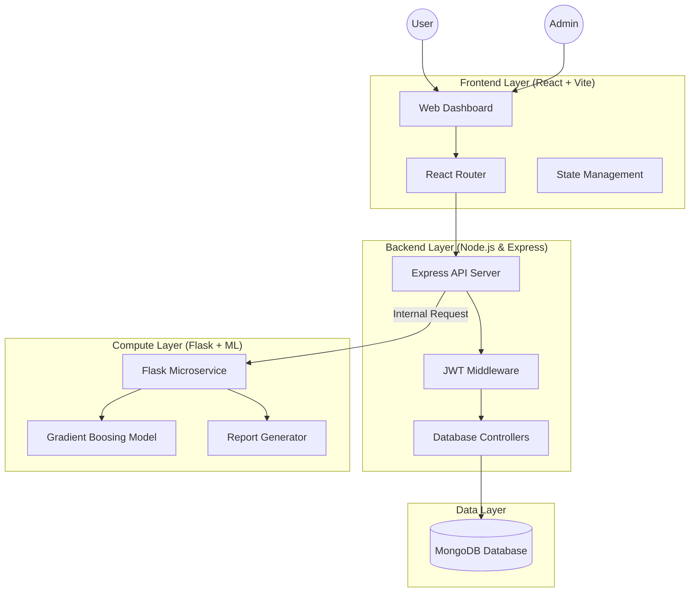

# PCOS Care - AI-Driven Full-Stack MERN Application

PCOS Care is a state-of-the-art, non-invasive digital health platform designed to empower women in managing Polycystic Ovary Syndrome (PCOS). By combining machine learning, real-time consultation management, and community support, it provides a comprehensive ecosystem for early screening and clinical management.

## 🌟 Key Features

- **🧠 ML-Powered Screening**: Utilizing a Gradient Boosting model to provide high-accuracy PCOS risk assessments based on non-invasive parameters.
- **📄 Clinical PDF Reports**: Instant generation of detailed medical reports for clinical transparency and physician consultation.
- **🏥 Expert Consultation**: Robust booking system for gynecologists, nutritionists, and therapists with real-time status tracking.
- **🤖 AI Quality Guardian**: An integrated chatbot assistant for immediate support and project guidance.
- **👥 Community & Insights**: A decentralized social hub for sharing experiences, joining support groups, and discovering health events.
- **🔐 Admin Ecosystem**: Comprehensive dashboard for admins to manage clinic appointments, messages, and expert directories.

## 🏗️ System Architecture & Design

### High-Level Architecture
The platform follows a microservices-inspired architecture, decoupling the compute-intensive ML logic from the core application business logic.



### Component Breakdown
1. **Frontend (Client)**: A responsive SPA built with React, styled using Vanilla CSS for a premium, custom aesthetic. It handles real-time UI updates for appointment statuses and prediction history.
2. **Backend (Server)**: A RESTful API built with Express.js that manages authentication, business logic for community posts, and serves as a gateway to the ML service.
3. **ML Service (Intelligence)**: A Python/Flask microservice that performs inference using a pre-trained scikit-learn model. It analyzes key risk drivers for every prediction to ensure explainable AI.
4. **Database (Persistence)**: MongoDB stores user profiles, encrypted credentials, prediction records, and clinic appointment data.

## 🧠 Machine Learning Pipeline

The core "brain" of the project focuses on transparency and accuracy:
1. **Inference**: The model receives 20+ non-invasive inputs (Age, BMI, Cycle Length, etc.) and returns a probability score.
2. **Analysis**: The system identifies the "Top Risk Drivers" for each specific user, explaining *why* a particular result was achieved.
3. **Reporting**: The Flask service generates a `ReportLab` PDF containing clinical summaries and visualizations for the user to share with their physician.

## 🚀 Quick Start & Setup

### 1. Prerequisites
- **Node.js** (v18+) & **npm**
- **Python** (v3.10+)
- **MongoDB** (Local instance recommended)

### 2. Installation
```bash
# Clone the repository
git clone https://github.com/727623BIT053Evelin/Non-invasive-PCOS-Mern-Project.git
cd Non-invasive-PCOS-Mern-Project

# Setup Backend
cd server && npm install

# Setup Frontend
cd ../client && npm install

# Setup ML Service
cd ../ml_service && pip install -r requirements.txt
```

### 3. Execution
1. **ML Service**: `cd ml_service && python app.py` (Runs on Port 5001)
2. **Server**: `cd server && npm run dev` (Runs on Port 5000)
3. **Frontend**: `cd client && npm run dev` (Runs on Port 3000)

## 📦 Project Structure

```bash
.
├── client/              # React/Vite Frontend
│   └── src/pages/       # Dashboard, Prediction, Consultation pages
├── server/              # Express/Node Backend
│   ├── routes/          # API Endpoints (Auth, Predictions, Appointments)
│   └── models/          # Mongoose Schemas
├── ml_service/          # Flask Python Service (AI Inference/Reports)
└── ml_model/            # Serialized ML Models (.joblib)
```

## 🔐 Security & Access Control
- **JWT Authentication**: Secure stateless sessions for all user activities.
- **AdminAuth Middleware**: Restricted access to appointment management and message inboxes.
- **PrivateRoutes**: Frontend protection to ensure data privacy for sensitive health records.

## 🎨 Design System
- **Colors**: Signature Violet (`#8B5CF6`) and clinical White/Gray palettes.
- **Typography**: Outfit & Inter for high readability.
- **UX**: Card-based layouts with smooth micro-animations for a premium feel.

---
**Disclaimer**: This platform is a screening tool and does not replace professional medical advice. Always consult with a healthcare professional for diagnosis.

Developed by **Evelin** | [GitHub Portfolio](https://github.com/727623BIT053Evelin)
